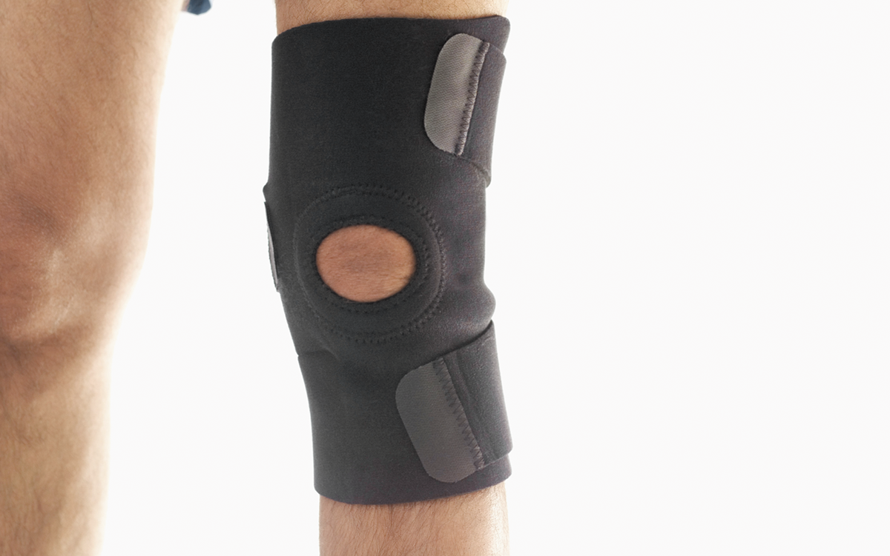

# Data Science Portfolio

Here are some of my best Data Science Projects. I have explored various machine-learning algorithms for different datasets. Feel free to contact me to learn more about my experience working with these projects.

---

[Prediction of Seoul Bike count](https://github.com/Gilbert228/Prediction-of-Seoul-Bike-count-)

**Skills used:** Python, Pandas, SKlearn, Matplotlib

**Project Objective:** Predicting Bike rental demand on basis of weather and seasonal factors in advance to take appropiate measures which finally will result in bike utilization.

**Quantifiable result:** We could predict the Bike rental demand resulting in [**54%** accuracy](https://github.com/Gilbert228/Prediction-of-Seoul-Bike-count-).

- Used Linear Rigression to predict the number of bikes rented in the city of Seoul
- The data had quite a few categorical variables which were encoded for use in the model
- Encoded categorical variables to numeric using Sklearn due to the presence of many string columns

---

[Predicting Breast Cancer](https://github.com/Gilbert228/Predicting-Breast-Cancer)

**Skills used:** Python, Pandas, SKlearn, Matplotlib

**Project Objective:** Identification of the type of Breast Cancer for quicker diagnosis. This assists professionals in the medical field to take appropiate measures to accurately diagnose, treat and save lives.

**Quantifiable result:** We could Classify the type of tumor resulting in [**97%** accuracy using Logistic Rigression algorithm](https://github.com/Gilbert228/Predicting-Breast-Cancer).

- Used logistic regression to identify a tumour as malignant or benign based on various attributes
- Classified tumors as benign or malignant by studying patterns in measured attributes of those tumors
- Used Logistic regression classifier & optimized the accuracy by using the ROC curve
- Explored a machine learning approach to medical diagnosis

---

[Talking data fraud detection](https://github.com/Gilbert228/Talking-data-fraud-detection)

**Skills used:** Python, Pandas, SKlearn, Matplotlib

**Project Objective:** In this problem, we will use the features associated with clicks, such as IP address, operating system, device type, time of click etc. to predict the probability of a click being fraud.

**Quantifiable result:** We could predict whether a given click resulted in a download or not. The accuracy of the XGBoostClassifier is [**98%** ](https://github.com/Gilbert228/Talking-data-fraud-detection. of the Bagging classifier accuracy is [**99%** ](https://github.com/Gilbert228/Talking-data-fraud-detection).

- Used the XGboost Classifier algorithm to classify the Pepole who downloaded the app after watching the advertisement and identify the click fraud
- Compared predictive performance by fitting a BaggingClassifier model to the data
- Selected best model based on train and test performance
- Explored Ensemble technique.

---

<!-- [Identifying given picture is a Cat or a Dog](<https://github.com/suvo-gh/Cat_or_Dog_prediction/blob/main/CNN_Project%20(Image_Classification).ipynb>)

**Skills used:** Python, Keras, Tensorflow

**Project Objective:** Prediction of whether a given image is a Cat or a Dog using Convolutional Neural Networks which may be further implemented as a feature in a bigger project.

**Quantifiable result:** We could train the Convolutional Neural Network to attain a accuracy of [**80%** using **23** epochs](<https://github.com/suvo-gh/Cat_or_Dog_prediction/blob/main/CNN_Project%20(Image_Classification).ipynb>).

- Added multiple convolution and pooling layers
- Training model on basis of given data
- Fitting the CNN to see if the provided image is dog or cat
- Data Source: https://drive.google.com/drive/folders/15SG-chdqEwcrNAY39RTZJjvl-UwiZo_e?usp=sharing -->

---

[classification of the client will subscribe a term deposit](https://github.com/Gilbert228/Logistic_Regression)

**Skills used:** Python, Pandas, SKlearn, Matplotlib

**Project Objective:** The classification goal is to predict if the client will subscribe a term deposit (variable y). 

**Quantifiable result:** We could Classify the Term deposit resulting in [**94%** accuracy](https://github.com/Gilbert228/Logistic_Regression).

- Used Logistic Regression to Classify if the client will subscribe a term deposit.
- The data had quite a few categorical variables which were encoded for use in the model.
- Encoded categorical variables to numeric using Sklearn due to the presence of many string columns.

---

[Identifying symtoms of prthopedic patients as normal and abnormal](https://github.com/Gilbert228/Orthopedic-Patient-Prediction)

**Skills used:** Python, Pandas, SKlearn, Matplotlib,KNN,NB

**Project Objective:** The classification goal is to Classify the orthopedic parameters as Normal and Abnormal. 

**Quantifiable result:** We could Classify with the resulting in [**86%** accuracy](https://github.com/Gilbert228/Orthopedic-Patient-Prediction).

-Used the K Nearest Neighbours algorithm to classify a patient’s condition as normal or abnormal based on various orthopedic parameters
-Compared predictive performance by fitting a Naive Bayes model to the data
-Selected best model based on train and test performance

---
